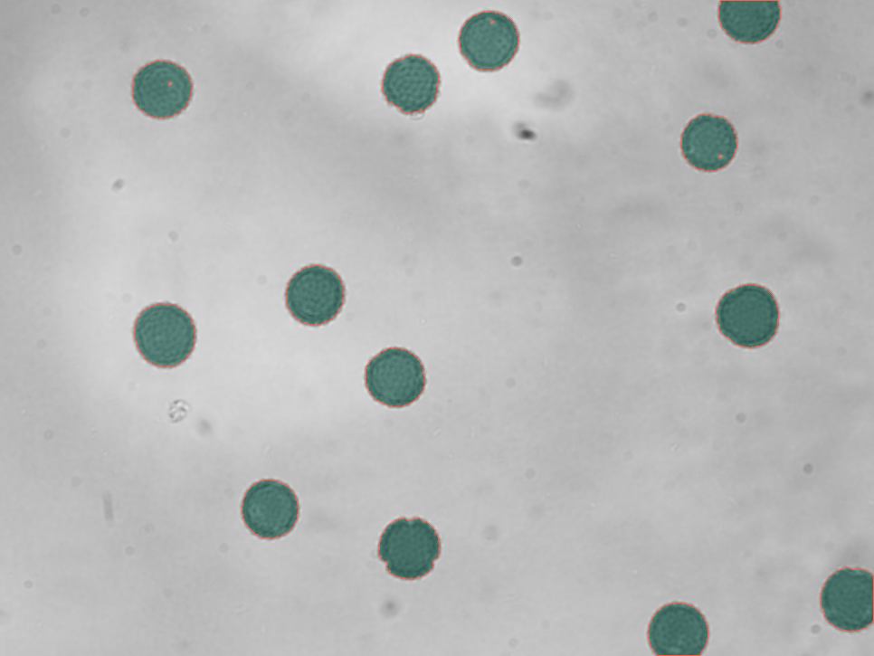

# microtrace

## Français

Microtrace est une boîte à outils de morphométrie reproductible pour images
de type microscopie. Le projet aide les laboratoires de biologie à transformer
des micrographies brutes en mesures transparentes par objet, résumés par image,
overlays de segmentation et rapports HTML partageables, sans imposer un flux
de travail lourd.

Il est pensé pour le tri rapide d'expériences, le développement de méthodes et
les jeux de données pédagogiques. Il inclut un générateur d'images synthétiques
afin que les exemples et les tests puissent fonctionner sans données
expérimentales réelles.

## Périmètre Actuel

- Analyser une image seule ou un dossier d'images.
- Segmenter des objets biologiques clairs sur fond sombre.
- Mesurer l'aire, le périmètre, la circularité, l'élongation, le centroïde et
  l'intensité.
- Exporter des tableaux CSV au niveau objet et au niveau image.
- Générer un rapport HTML avec des résumés visuels compacts.
- Créer des séries d'images synthétiques de type microscopie pour des démos
  reproductibles.

## Installation

```bash
python -m pip install .
```

Pour le développement :

```bash
python -m pip install -e ".[dev]"
```

## Démarrage Rapide

```bash
microtrace demo demo-output
```

La commande de démo crée des images synthétiques, lance le pipeline d'analyse
et écrit un rapport dans `demo-output/report`.

Pour exécuter les étapes manuellement :

```bash
microtrace simulate synthetic-data --images-per-condition 3 --seed 21
microtrace analyze synthetic-data --output results
```

Pour des images en lumière transmise ou contraste de phase, comme des levures avec
des halos et des contours sombres, utiliser le mode `brightfield` :

```bash
microtrace analyze image.jpg --output results --mode brightfield --min-size 120
```

Si des cellules proches sont encore fusionnées, essayer un seuil plus strict :

```bash
microtrace analyze image.jpg --output results --mode brightfield --min-size 120 --threshold 0.34
```

Exemple avec des grains de pollen colorés sur fond clair :

```bash
microtrace analyze pollens_grains.png --output results/pollen --mode intensity --invert --min-size 500
```

Sur l'image d'exemple testée, Microtrace détecte 13 grains de pollen, avec une
aire médiane de 3337 px et une élongation moyenne proche de 1.08, cohérente
avec des objets presque circulaires.



La commande d'analyse écrit :

- `objects.csv` : une ligne par objet segmenté.
- `summary.csv` : une ligne par image.
- `report.html` : un rapport partageable avec résumés par condition et overlays.
- `overlays/` : des PNG montrant les contours des objets segmentés.

## Modèle de Mesure

Microtrace segmente les objets clairs avec un seuillage d'Otsu ou un seuil
fourni par l'utilisateur. Les petites composantes connexes sont supprimées,
puis chaque objet restant est mesuré indépendamment.

Les mesures au niveau objet incluent :

- aire et périmètre en pixels,
- circularité,
- élongation calculée à partir de la matrice de covariance de l'objet,
- centroïde et boîte englobante,
- intensité moyenne et intensité intégrée.

Les résumés au niveau image agrègent le nombre d'objets, l'aire totale, l'aire
médiane, la circularité moyenne, l'élongation moyenne et l'intensité moyenne.

## Données Synthétiques

Le générateur synthétique crée deux conditions simples par défaut :

- `control` : objets plus grands et plus compacts,
- `stress` : objets plus petits et plus fragmentés.

Le générateur écrit un fichier `metadata.csv` avec des identifiants d'images
relatifs, les noms de conditions, les graines aléatoires et les paramètres de
simulation.

## Développement

Lancer la suite de tests :

```bash
python -m pytest
```

## Objectifs de Conception

Microtrace garde le chemin d'analyse explicite : chaque résultat vient de
l'image d'entrée, d'un seuil de segmentation et d'un ensemble documenté de
mesures. Les fichiers produits évitent les chemins locaux absolus afin que les
rapports puissent être partagés sans exposer de détails de poste de travail.

---

## English

Microtrace is a small, reproducible morphometry toolkit for microscopy-style
assay images. It helps biology labs turn raw micrographs into transparent
object-level measurements, image summaries, segmentation overlays, and
shareable HTML reports without requiring a heavy desktop workflow.

The project is designed for early experiment triage, method development, and
teaching datasets. It includes a synthetic image generator so examples and
tests can run without bundling real experimental data.

## Current Scope

- Analyze single images or folders of images.
- Segment bright biological objects on darker backgrounds.
- Measure area, perimeter, circularity, elongation, centroid, and intensity.
- Export object-level and image-level CSV tables.
- Build an HTML report with compact visual summaries.
- Generate synthetic microscopy-like image sets for reproducible demos.

## Installation

```bash
python -m pip install .
```

For development:

```bash
python -m pip install -e ".[dev]"
```

## Quick Start

```bash
microtrace demo demo-output
```

The demo command creates synthetic images, runs the analysis pipeline, and
writes a report into `demo-output/report`.

To run each step manually:

```bash
microtrace simulate synthetic-data --images-per-condition 3 --seed 21
microtrace analyze synthetic-data --output results
```

For transmitted-light or phase-contrast images, such as yeast cells with halos
and dark outlines, use `brightfield` mode:

```bash
microtrace analyze image.jpg --output results --mode brightfield --min-size 120
```

If nearby cells are still merged, try a stricter threshold:

```bash
microtrace analyze image.jpg --output results --mode brightfield --min-size 120 --threshold 0.34
```

Example with colored pollen grains on a bright background:

```bash
microtrace analyze pollens_grains.png --output results/pollen --mode intensity --invert --min-size 500
```

On the tested example image, Microtrace detects 13 pollen grains, with a median
area of 3337 px and a mean elongation close to 1.08, consistent with nearly
circular objects.


The analysis command writes:

- `objects.csv`: one row per segmented object.
- `summary.csv`: one row per image.
- `report.html`: a shareable report with condition summaries and overlays.
- `overlays/`: PNG overlays showing the segmented object boundaries.

## Measurement Model

Microtrace segments bright objects with either Otsu thresholding or a user
provided threshold. Small connected components are removed, then each remaining
object is measured independently.

Object-level measurements include:

- area and perimeter in pixels,
- circularity,
- elongation from the object covariance matrix,
- centroid and bounding box,
- mean and integrated intensity.

Image-level summaries aggregate object count, total area, median area, mean
circularity, mean elongation, and mean intensity.

## Synthetic Data

The synthetic generator creates two simple conditions by default:

- `control`: larger, more compact objects,
- `stress`: smaller and more fragmented objects.

The generator writes a `metadata.csv` file with relative image identifiers,
condition names, seeds, and simulation parameters.

## Development

Run the test suite with:

```bash
python -m pytest
```

## Design Goals

Microtrace keeps the analysis path explicit: every result is derived from the
input image, a segmentation threshold, and a documented set of measurements.
The output files avoid absolute local paths so reports can be shared without
leaking workstation details.
